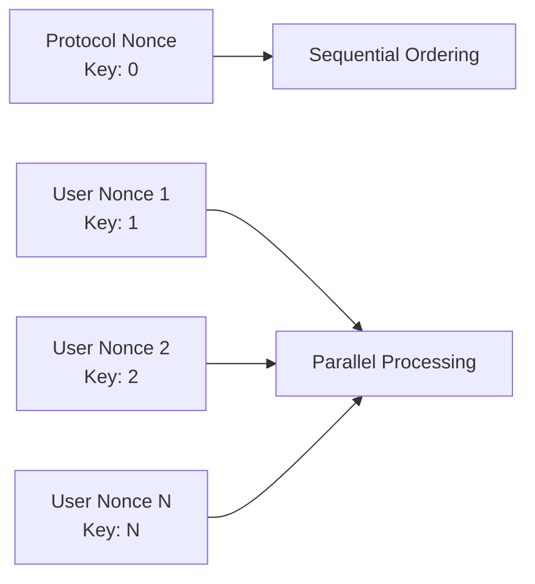
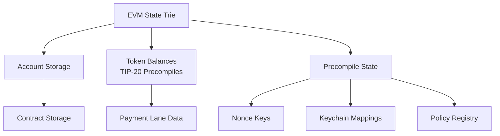
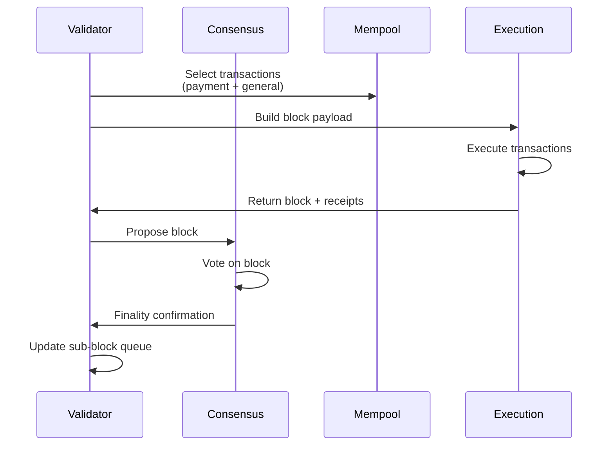

Tempo is built on a modular architecture that combines proven technologies with custom optimizations for high-throughput stablecoin payments.

## Core Components

### Execution Layer: Reth SDK

Tempo's execution layer is built on the [Reth SDK](https://github.com/paradigmxyz/reth), the most performant and flexible Ethereum Virtual Machine (EVM) execution client.

<CardGroup cols={2}>
  <Card title="Performance" icon="gauge-high">
    Reth provides optimized state management and transaction execution, enabling Tempo to achieve ~20,000 TPS for payment transactions.
  </Card>
  <Card title="Modularity" icon="cubes">
    The SDK's modular design allows Tempo to customize components like transaction pools, precompiles, and block building while maintaining EVM compatibility.
  </Card>
</CardGroup>

**Key Reth Features Used:**
- Custom transaction pool with 2D nonce support for parallel transaction processing
- Optimized state trie with efficient storage access patterns
- Flexible precompile system for enshrined token standards (TIP-20)
- EIP-1559 fee market with stablecoin-denominated pricing

### Consensus: Simplex via Commonware

Tempo uses **Simplex consensus**, implemented via [Commonware](https://commonware.xyz/), designed specifically for high-throughput payment chains.

<Note>
Simplex achieves **sub-second finality** in normal network conditions while gracefully degrading performance under adverse conditions rather than halting.
</Note>

**Consensus Characteristics:**
- **Fast finality**: Blocks are finalized in &lt;1 second under normal conditions
- **Graceful degradation**: Network partitions slow down but don't stop block production
- **Validator rotation**: Validators participate in block production based on stake
- **Byzantine fault tolerance**: Tolerates up to 1/3 of validators being malicious or offline

### Transaction Pool Architecture

Tempo's transaction pool implements a **2D nonce system** that enables parallel transaction processing:



**Pool Features:**
- **Payment lane**: Dedicated capacity for TIP-20 transfers (450M gas/block)
- **General lane**: Smart contract interactions (30M gas/block)
- **Shared capacity**: 50M gas reserved for validator sub-blocks
- **Multi-currency fees**: Automatic fee conversion via Fee AMM

## Precompile System

Tempo implements critical functionality as **enshrined precompiles** for performance and predictability:

<AccordionGroup>
  <Accordion title="TIP-20 Token Standard (0x20c0...)">
    ERC-20 compatible tokens with built-in memos, payment lanes, and compliance hooks. Implemented as precompiles for predictable gas costs.
    
    **Gas efficiency**: TIP-20 transfers cost ~50,000 gas (0.1 cent) vs ~100,000+ gas for standard ERC-20.
  </Accordion>
  
  <Accordion title="TIP-403 Policy Registry">
    Shared compliance policies across multiple tokens. Update once, enforce everywhere.
  </Accordion>
  
  <Accordion title="Fee AMM">
    Automatic stablecoin conversion for fee payments. Users pay in any supported stablecoin, validators receive their preferred currency.
  </Accordion>
  
  <Accordion title="Account Keychain">
    Protocol-level key management supporting passkeys (P256/WebAuthn), spending limits, and key rotation without changing addresses.
  </Accordion>
  
  <Accordion title="Nonce Manager">
    2D nonce tracking for parallel transaction submission from the same account.
  </Accordion>
  
  <Accordion title="Stablecoin DEX">
    On-chain order book for stablecoin swaps with price discovery and liquidity provision.
  </Accordion>
</AccordionGroup>

## Block Structure

Tempo blocks consist of three main sections:

```rust
pub struct TempoBlock {
    // Standard block header
    pub header: Header,
    
    // Proposer transactions (payment + general)
    pub proposer_transactions: Vec<TempoTxEnvelope>,
    
    // Validator sub-blocks (shared gas pool)
    pub sub_blocks: Vec<SubBlock>,
}
```

### Gas Allocation

| Component | Gas Limit | Purpose |
|-----------|-----------|----------|
| Total Block | 500M gas | Combined capacity |
| Proposer Pool | 450M gas | Payment + general transactions |
| Payment Lane | Up to 450M | TIP-20 transfers only |
| General Lane | 30M gas | Smart contracts |
| Sub-blocks | 50M gas | Validator transactions |

<Info>
The payment lane is **non-dedicated** — both payment and general transactions share the 450M proposer budget, but general transactions are capped at 30M to guarantee payment capacity.
</Info>

## Transaction Types

Tempo supports multiple transaction formats:

<CardGroup cols={2}>
  <Card title="Tempo Transactions" icon="layer-group">
    **Type 0x76** - Native format with batching, fee sponsorship, scheduling, and multi-signature support (secp256k1, P256, WebAuthn).
  </Card>
  <Card title="Legacy Ethereum" icon="ethereum">
    **Types 0x00-0x03** - Standard Ethereum transaction types for backward compatibility with existing tools.
  </Card>
</CardGroup>

## State Management

### Storage Architecture



### State Creation Costs (TIP-1000)

To prevent state bloat, Tempo implements elevated storage costs:

- **New state element**: 250,000 gas (vs 20,000 in Ethereum)
- **Account creation**: 250,000 gas when first nonce is written
- **Contract deployment**: 1,000 gas/byte + 500,000 gas base cost

<Warning>
At 250,000 gas per state element and 0.1 cent per 50,000 gas, creating 1TB of state costs ~$50M — a strong economic deterrent against spam.
</Warning>

## Network Layer

Tempo uses standard Ethereum networking protocols with extensions:

- **Discovery**: ENR-based peer discovery
- **Block propagation**: Optimistic relay with sub-block support
- **Transaction gossip**: Separate channels for payment/general lanes
- **Sync**: Snap sync for fast bootstrapping

## Validator Operations



### Sub-block System

Validators can include transactions in **sub-blocks** using reserved gas:

- Each validator gets 50M gas/block shared pool
- Sub-blocks execute after proposer transactions
- Deterministic ordering prevents MEV exploitation
- Used for validator operations (configuration updates, rewards claims)

## API & RPC Layer

Tempo nodes expose standard Ethereum JSON-RPC with extensions:

**Standard Methods:**
- All `eth_*` methods (send, call, estimateGas, etc.)
- Standard transaction receipts and logs
- Block and transaction queries

**Tempo Extensions:**
- `tempo_fundAddress` - Testnet faucet
- `tempo_*` - Custom methods for Tempo transaction types
- Enhanced transaction receipts with sub-block data

<Card title="See the RPC Reference" icon="book" href="/api/overview">
  Complete documentation of all available RPC methods
</Card>

## Security Model

### Economic Security

1. **Validator staking**: Validators must stake capital to participate
2. **Slashing conditions**: Malicious behavior results in stake loss
3. **Fee incentives**: Validators earn fees for including transactions

### Execution Security

1. **EVM equivalence**: Inherits Ethereum's battle-tested execution security
2. **State rent economics**: High storage costs prevent state bloat attacks
3. **Precompile isolation**: Enshrined logic runs with controlled gas costs

### Network Security

1. **BFT consensus**: Tolerates up to 1/3 Byzantine validators
2. **Finality guarantees**: Blocks cannot be reverted after finalization
3. **Graceful degradation**: Network partitions slow but don't halt progress

## Development Tools

Tempo is fully compatible with Ethereum tooling:

- **Foundry**: Smart contract development and testing
- **Hardhat**: Contract deployment and automation
- **Ethers/Viem**: JavaScript transaction construction
- **Alloy**: Rust-based SDK with Tempo types

<CardGroup cols={2}>
  <Card title="SDK Documentation" icon="code" href="/sdk/overview">
    Official SDKs for TypeScript, Rust, Go, and Foundry
  </Card>
  <Card title="Smart Contract Guide" icon="file-contract" href="/guides/deploying-contracts">
    Deploy and interact with contracts on Tempo
  </Card>
</CardGroup>

## Performance Characteristics

| Metric | Target | Notes |
|--------|--------|-------|
| Block time | 500ms | Sub-second blocks |
| Finality | &lt;1s | Under normal conditions |
| Payment TPS | ~20,000 | TIP-20 transfers |
| Transfer cost | 0.1 cent | To existing address |
| Contract TPS | ~600 | Complex interactions |
| State growth | Limited | Via TIP-1000 economics |

<Info>
These targets represent mainnet configuration. Testnet parameters may differ.
</Info>

## Upgrade Path: Osaka Hardfork

Tempo targets the **Osaka hardfork** for EVM compatibility, which includes:

- EOF (EVM Object Format) for improved bytecode
- Advanced precompile features
- Enhanced transaction types
- Improved gas accounting

See [EVM Compatibility](/concepts/evm-compatibility) for detailed differences from Ethereum.
