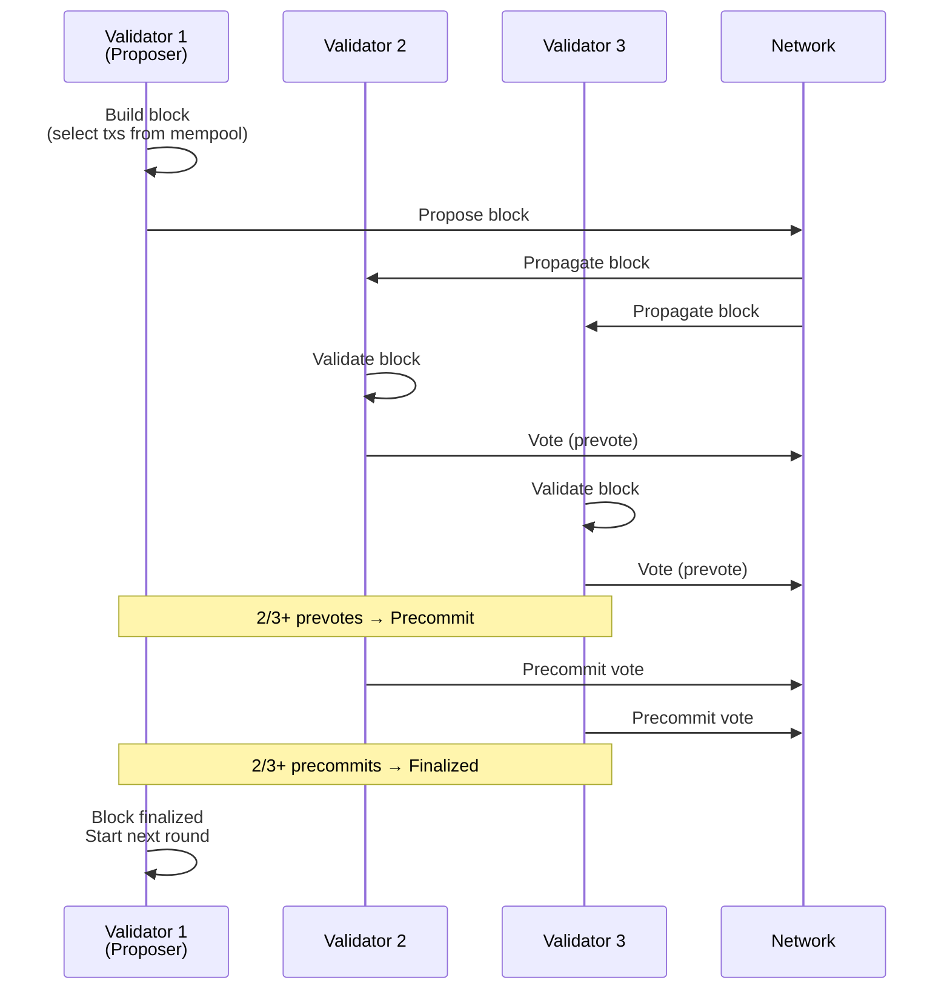
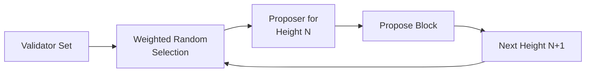
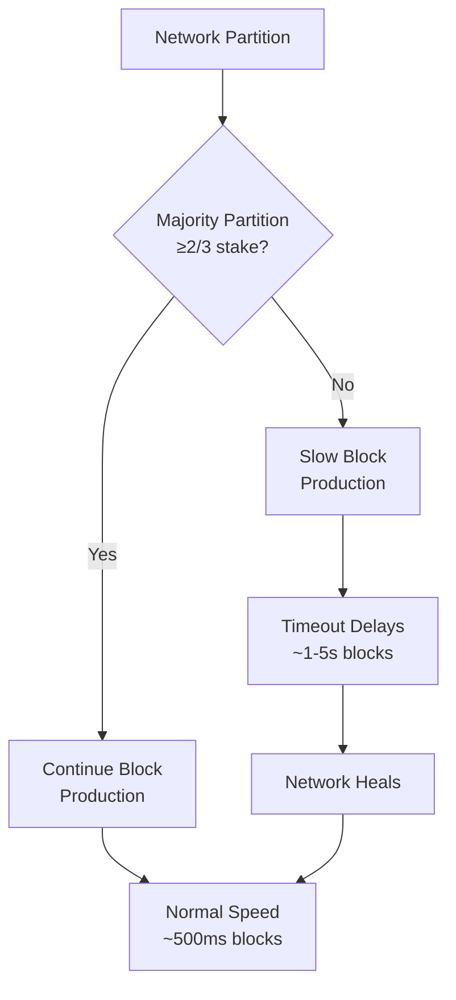
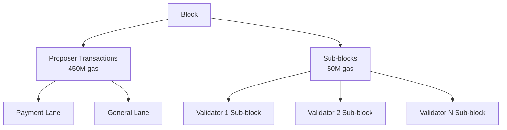
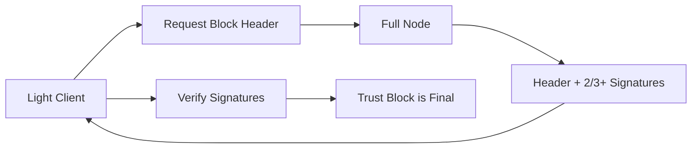
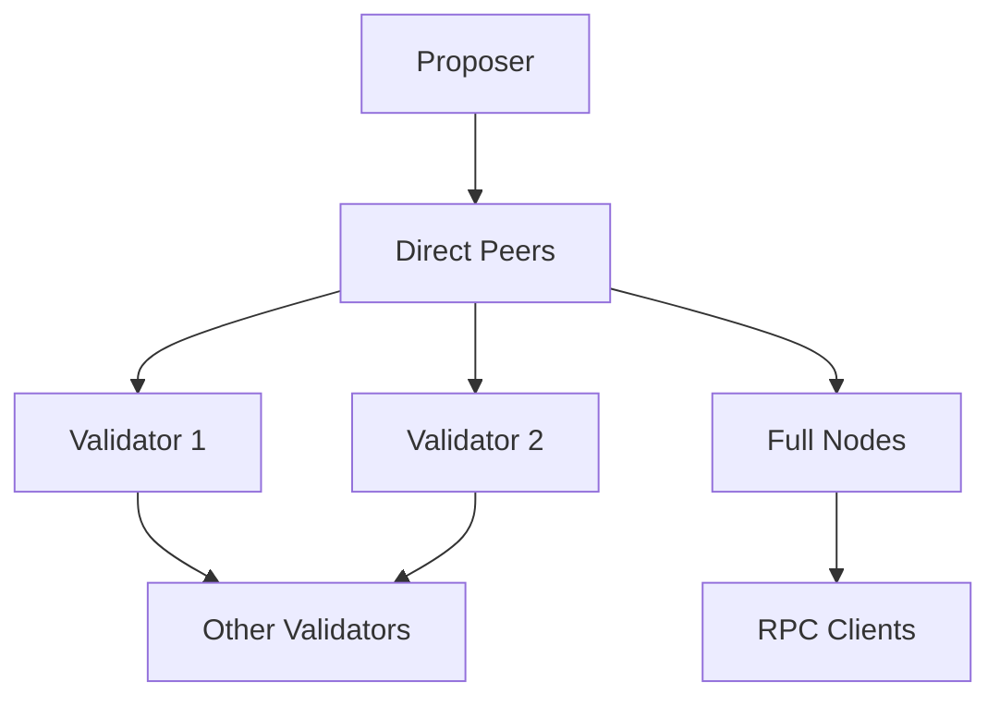

Tempo uses **Simplex consensus**, implemented via [Commonware](https://commonware.xyz/), designed for high-throughput blockchain networks that prioritize availability and fast finality.

<Note>
Simplex achieves **sub-second finality** under normal network conditions while gracefully degrading performance (rather than halting) during adverse conditions.
</Note>

## Design Goals

Simplex is optimized for Tempo's payment-focused use case:

<CardGroup cols={2}>
  <Card title="Fast Finality" icon="bolt">
    Blocks finalize in &lt;1 second under normal conditions, enabling near-instant payment confirmation.
  </Card>
  <Card title="High Throughput" icon="gauge-high">
    Supports ~20,000 TPS for TIP-20 transfers with 500ms block times.
  </Card>
  <Card title="Graceful Degradation" icon="shield-check">
    Network partitions slow block production but don't halt the chain.
  </Card>
  <Card title="Simple Validator Set" icon="users">
    Straightforward validator management without complex fork choice rules.
  </Card>
</CardGroup>

## How It Works

### Block Production Cycle



### Voting Phases

1. **Proposal**: Validator proposes a block with transactions from mempool
2. **Prevote**: Validators vote on the proposed block after validation
3. **Precommit**: After seeing 2/3+ prevotes, validators commit to finalize
4. **Finalization**: Block is final after 2/3+ precommit votes

<Info>
Each phase requires **2/3+ of validator stake** to proceed, ensuring Byzantine fault tolerance.
</Info>

## Validator Selection

Validators participate in block production based on their stake:

### Proposer Rotation



Proposer selection is **deterministic** based on:
- Block height
- Validator stake (higher stake = higher probability)
- Validator public key (for tie-breaking)

### Validator Participation

**Active Set**: All validators with sufficient stake participate in voting

**Minimum Stake**: To be included in the validator set, a validator must:
- Meet the minimum stake requirement (configured in genesis)
- Register via the ValidatorConfig precompile
- Be active (not jailed or exited)

**Maximum Set Size**: The protocol may limit total validator count for efficiency

## Finality Guarantees

### Immediate Finality

Unlike probabilistic finality (Proof of Work), Simplex provides **immediate economic finality**:

<AccordionGroup>
  <Accordion title="Economic Finality">
    Once a block receives 2/3+ precommit votes, it is **irreversibly final**. Reverting it would require:
    
    1. 2/3+ of validators to collude
    2. All colluding validators to be slashed (lose their entire stake)
    
    **Cost to attack**: If 2/3 of total stake is 100M tokens at $1 each = $100M security.
  </Accordion>
  
  <Accordion title="No Reorgs">
    Finalized blocks can never be reorganized or reverted. This is fundamentally different from Proof of Work, where any block can theoretically be reorged with sufficient hashpower.
  </Accordion>
  
  <Accordion title="Fast Confirmation">
    Applications can safely treat finalized blocks as permanent after &lt;1 second, enabling:
    - Instant payment confirmation
    - Real-time settlement
    - Low-latency DeFi operations
  </Accordion>
</AccordionGroup>

### Liveness Under Partition

Simplex prioritizes **availability** over consistency during network partitions:



<Warning>
**Partition Tolerance**: If >1/3 of validators go offline or are partitioned, block production slows significantly but does not halt. Once connectivity is restored, normal operation resumes.
</Warning>

## Consensus Parameters

| Parameter | Value | Purpose |
|-----------|-------|----------|
| Block Time | 500ms | Target time between blocks |
| Timeout Propose | 500ms | Max time to wait for proposal |
| Timeout Prevote | 200ms | Max time to collect prevotes |
| Timeout Precommit | 200ms | Max time to collect precommits |
| Byzantine Tolerance | 33% | Max malicious validator stake |
| Finality Threshold | 67% | Min votes to finalize |

<Info>
Timeout values increase exponentially during periods of asynchrony to ensure liveness while maintaining safety.
</Info>

## Validator Operations

### Registration

Validators register via the **ValidatorConfig** precompile:

```solidity
interface IValidatorConfig {
    function registerValidator(
        bytes calldata publicKey,
        uint256 stake,
        string calldata endpoint
    ) external;
    
    function updateStake(uint256 newStake) external;
    
    function deregister() external;
}
```

### Rewards

Validators earn rewards from:

1. **Block rewards**: Fixed per-block issuance (if configured)
2. **Transaction fees**: Base fees from all transactions in their blocks
3. **Priority fees**: Tips from transactions (EIP-1559 style)

**Reward Distribution**:
- Proposer receives 100% of fees from their block
- Sub-block validators receive fees from their sub-block transactions
- Rewards are automatically credited to validator accounts

### Slashing

Validators can be slashed for:

<CardGroup cols={2}>
  <Card title="Double Signing" icon="xmark">
    Signing two different blocks at the same height.
    
    **Penalty**: 100% stake slash (complete loss)
  </Card>
  <Card title="Downtime" icon="clock">
    Missing too many consecutive votes (configurable threshold).
    
    **Penalty**: Jailing (temporary removal) or minor stake slash
  </Card>
</CardGroup>

**Slashing Evidence**: Any validator can submit proof of misbehavior on-chain to trigger slashing.

### Jailing

Validators can be temporarily removed ("jailed") for:
- Extended downtime
- Minor infractions
- Self-initiated maintenance

**Unjailing**: Validators can unjail themselves after a cooldown period by calling `unjail()` on ValidatorConfig.

## Sub-block System

Validators can include transactions in **sub-blocks** using reserved gas:



**Sub-block Characteristics**:
- Execute **after** proposer transactions
- Deterministic ordering (by validator index or stake)
- Used for validator operations (config updates, reward claims)
- Cannot be censored by proposer

<Info>
Sub-blocks ensure validators can always submit critical transactions (like unstaking or reward claims) even if proposers attempt censorship.
</Info>

## Consensus Safety

### Fork Prevention

Simplex prevents forks through:

1. **2/3+ voting threshold**: No conflicting blocks can both reach finality
2. **Slashing for equivocation**: Double-signing is economically irrational
3. **Lock-step progression**: Validators cannot skip heights or vote on future blocks

### Attack Vectors

<AccordionGroup>
  <Accordion title="51% Attack (Not Possible)">
    Unlike Proof of Work, 51% of validators **cannot** revert finalized blocks. Simplex requires 67% consensus, so even 66% of validators colluding cannot finalize conflicting blocks.
    
    **Defense**: 2/3+ threshold and slashing make this economically infeasible.
  </Accordion>
  
  <Accordion title="Long-Range Attack (Not Possible)">
    Attackers with old validator keys cannot create an alternative history because:
    - Finalized blocks include 2/3+ signatures from validators at that height
    - Current validator set only accepts signatures from recent validator sets
    - Unbonding period prevents "nothing at stake" attacks
    
    **Defense**: Validator set transitions and unbonding delays.
  </Accordion>
  
  <Accordion title="Liveness Attack (Partial)">
    If 34%+ validators go offline, block production slows but doesn't stop (timeouts increase).
    
    **Impact**: Degraded performance, not complete halt.
    **Defense**: Timeout escalation and eventual ejection of offline validators.
  </Accordion>
</AccordionGroup>

## Light Client Support

Simplex is designed for efficient light client verification:



**Light Client Requirements**:
- Store validator set (or recent validator set root)
- Verify 2/3+ signatures on block headers
- Update validator set on epoch boundaries

**Efficiency**: No need to download full blocks or execute transactions — signatures alone prove finality.

## Comparison with Other Consensus

| Feature | Simplex | Tendermint | Ethereum PoS | Bitcoin PoW |
|---------|---------|------------|--------------|-------------|
| Finality | Immediate | Immediate | ~15 min | Probabilistic |
| Time to Final | &lt;1s | ~5s | ~15 min | ~60 min |
| Fork Risk | None | None | Low | Medium |
| Partition Behavior | Slow blocks | Halt | Slow blocks | Continue |
| Validator Set Size | Flexible | Limited | ~1M | N/A |
| Light Clients | Efficient | Efficient | Moderate | Inefficient |

<Note>
**Similarity to Tendermint**: Simplex shares the BFT voting structure with Tendermint but optimizes for payment throughput and degrades gracefully instead of halting.
</Note>

## Network Topology

### Peer Discovery

Validators discover each other through:
- **Bootstrap nodes**: Hardcoded in genesis or config
- **ENR records**: Ethereum Name Records for node metadata
- **Gossipsub**: libp2p-based peer gossip protocol

### Block Propagation



**Optimistic Relay**: Validators immediately propagate blocks before full validation to minimize latency.

**Vote Aggregation**: Validators collect votes from peers and forward aggregated vote sets.

## Upgrade Path

Consensus upgrades are coordinated via:

1. **Hard forks**: Scheduled block height for protocol changes
2. **Validator signaling**: Validators indicate readiness by updating config
3. **Activation threshold**: Upgrade activates when 67%+ validators signal support

<Warning>
Validators running incompatible consensus software after a hard fork will be unable to participate and may be jailed for downtime.
</Warning>

## Running a Validator

<CardGroup cols={2}>
  <Card title="Node Setup" icon="server" href="/node/running">
    Complete guide to running a Tempo validator node
  </Card>
  <Card title="Staking" icon="coins" href="/node/running">
    How to stake tokens and participate in consensus
  </Card>
  <Card title="Monitoring" icon="chart-line" href="/node/maintenance">
    Validator monitoring and alerting setup
  </Card>
  <Card title="Security" icon="shield" href="/node/maintenance">
    Best practices for securing validator infrastructure
  </Card>
</CardGroup>

## Further Reading

- **Commonware Documentation**: [commonware.xyz](https://commonware.xyz/) - Simplex consensus implementation
- **Byzantine Fault Tolerance**: Understanding BFT consensus algorithms
- **Tendermint Whitepaper**: Similar consensus design (Simplex ancestral inspiration)
