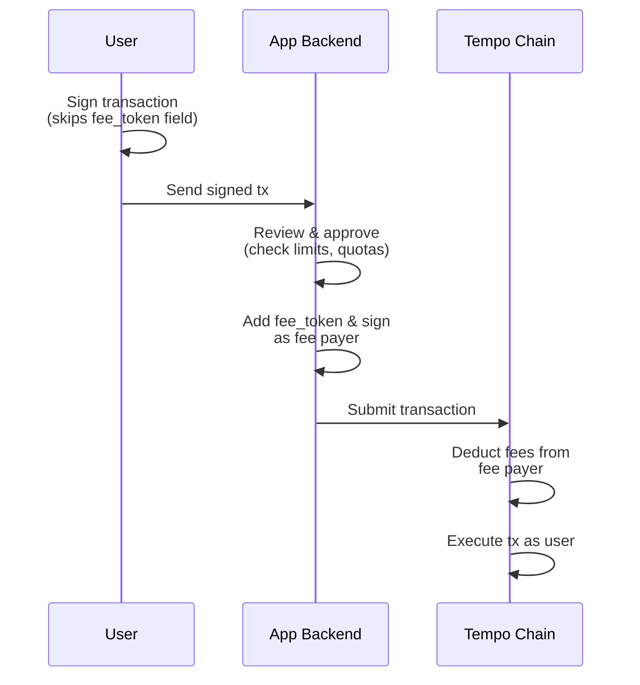
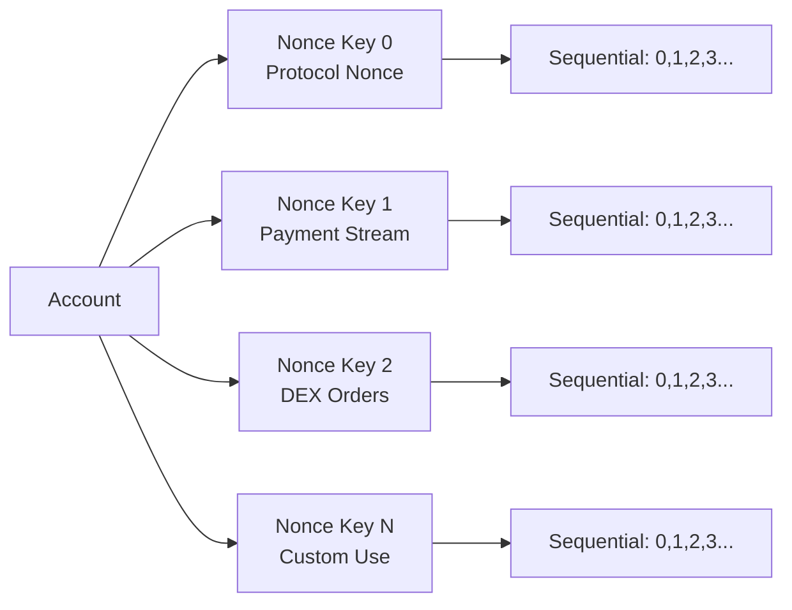
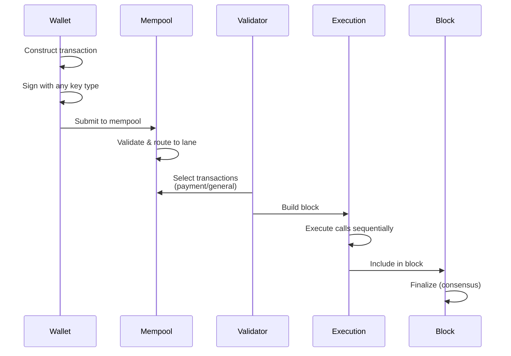

Tempo Transactions (type `0x76`) are Tempo's native transaction format that provides built-in smart account features without requiring proxy contracts or relayers.

<Note>
Tempo Transactions eliminate the need for external account abstraction infrastructure by enshrining key features directly in the protocol.
</Note>

## Overview

While Tempo supports standard Ethereum transaction types for compatibility, Tempo Transactions unlock powerful payment-focused features:

<CardGroup cols={2}>
  <Card title="Batched Operations" icon="layer-group">
    Execute multiple calls atomically in a single transaction — perfect for payroll, settlements, and multi-party payments.
  </Card>
  <Card title="Fee Sponsorship" icon="hand-holding-dollar">
    Apps can pay gas fees for users, enabling seamless onboarding without requiring users to hold fee tokens.
  </Card>
  <Card title="Scheduled Payments" icon="clock">
    Protocol-level time windows for recurring payments and timed disbursements with `validBefore`/`validAfter` fields.
  </Card>
  <Card title="Modern Auth" icon="fingerprint">
    Native support for passkeys via WebAuthn/P256 — use biometrics, secure enclave, and cross-device sync instead of seed phrases.
  </Card>
</CardGroup>

## Transaction Structure

```rust
pub struct TempoTransaction {
    // Standard EIP-1559 fields
    pub chain_id: u64,
    pub max_priority_fee_per_gas: u128,
    pub max_fee_per_gas: u128,
    pub gas_limit: u64,
    
    // Batch execution
    pub calls: Vec<Call>,  // Multiple operations executed atomically
    
    // 2D nonce system for parallelization
    pub nonce_key: U256,   // Key 0 = protocol nonce, 1+ = user nonces
    pub nonce: u64,        // Sequential nonce per key
    
    // Optional features
    pub fee_token: Option<Address>,           // Preferred fee payment token
    pub fee_payer_signature: Option<Signature>, // For fee sponsorship
    pub valid_before: Option<u64>,            // Unix timestamp upper bound
    pub valid_after: Option<u64>,             // Unix timestamp lower bound
    
    // Advanced features
    pub access_list: AccessList,
    pub key_authorization: Option<SignedKeyAuthorization>,
    pub tempo_authorization_list: Vec<TempoSignedAuthorization>,
}
```

## Batched Payments

Execute multiple operations atomically — if any call fails, the entire batch reverts.

<CodeGroup>
```typescript TypeScript
import { TempoTransactionRequest, Call } from '@tempo/sdk';
import { encodeFunctionData } from 'viem';

const calls: Call[] = [
  {
    to: tokenAddress,
    value: 0n,
    input: encodeFunctionData({
      abi: TIP20_ABI,
      functionName: 'transfer',
      args: [employee1, parseUnits('5000', 6)] // 5000 USDC
    })
  },
  {
    to: tokenAddress,
    value: 0n,
    input: encodeFunctionData({
      abi: TIP20_ABI,
      functionName: 'transfer',
      args: [employee2, parseUnits('3000', 6)] // 3000 USDC
    })
  },
  // Add up to gas limit (~600 transfers in one transaction)
];

const tx = await wallet.sendTransaction({
  calls,
  chainId: TEMPO_CHAIN_ID,
});
```

```rust Rust
use tempo_alloy::{TempoNetwork, primitives::transaction::Call};
use alloy::primitives::{U256, address};

let calls = vec![
    Call {
        to: token_address.into(),
        value: U256::ZERO,
        input: ITIP20::transferCall {
            to: employee1,
            amount: U256::from(5_000_000_000), // 5000 tokens (6 decimals)
        }
        .abi_encode()
        .into(),
    },
    Call {
        to: token_address.into(),
        value: U256::ZERO,
        input: ITIP20::transferCall {
            to: employee2,
            amount: U256::from(3_000_000_000),
        }
        .abi_encode()
        .into(),
    },
];

let pending = provider
    .send_transaction(TempoTransactionRequest {
        calls,
        ..Default::default()
    })
    .await?;
```
</CodeGroup>

### Use Cases

- **Payroll**: Pay hundreds of employees in a single transaction
- **Settlements**: Batch multiple invoices or refunds atomically
- **Multi-step DeFi**: Swap + transfer + stake in one transaction
- **Marketplace**: Purchase multiple items with atomic payment

<Warning>
Batch transactions revert atomically — design your application to handle all-or-nothing execution.
</Warning>

## Fee Sponsorship

Apps can pay transaction fees on behalf of users by providing a `fee_payer_signature`.

### How It Works



### Implementation

<CodeGroup>
```typescript Backend Service
import { TempoTransaction, recoverAddress } from '@tempo/sdk';

async function sponsorTransaction(userSignedTx: string) {
  // Decode user's transaction
  const tx = TempoTransaction.decode(userSignedTx);
  
  // Verify user signature
  const sender = await recoverAddress(tx);
  
  // Check sponsorship eligibility
  if (!await isEligible(sender)) {
    throw new Error('User not eligible for sponsorship');
  }
  
  // Set fee token (user didn't commit to this)
  tx.fee_token = FEE_TOKEN_ADDRESS;
  
  // Sign as fee payer
  const feePayer = getFeePayer(); // App's wallet
  const feePayerHash = tx.computeFeePayerHash(sender);
  tx.fee_payer_signature = await feePayer.signHash(feePayerHash);
  
  // Submit to chain
  return await provider.sendRawTransaction(tx.serialize());
}
```
</CodeGroup>

**Key Properties:**
- User signs transaction without `fee_token` field
- Fee payer adds `fee_token` and signs commitment
- User's signature remains valid regardless of fee token chosen
- Fee payer pays gas; user pays for state changes

<Info>
Fee sponsorship requires secp256k1 signatures for the fee payer. Users can use any supported signature type (secp256k1, P256, WebAuthn).
</Info>

### Sponsorship Strategies

<AccordionGroup>
  <Accordion title="Full Sponsorship">
    App pays all gas fees. Best for onboarding flows and promotional campaigns.
    
    **Rate limiting**: Implement per-user quotas to prevent abuse.
  </Accordion>
  
  <Accordion title="Conditional Sponsorship">
    Sponsor transactions meeting specific criteria (minimum amount, specific tokens, etc.).
    
    **Business logic**: Verify conditions before signing as fee payer.
  </Accordion>
  
  <Accordion title="Metered Sponsorship">
    Track sponsored gas and bill users later or deduct from platform credits.
    
    **Accounting**: Store sponsored amounts in your database for reconciliation.
  </Accordion>
</AccordionGroup>

## Scheduled Payments

Transactions can specify validity time windows using `validBefore` and `validAfter`.

```typescript
const scheduledPayment = {
  calls: [transferCall],
  validAfter: Math.floor(Date.now() / 1000) + 3600,  // 1 hour from now
  validBefore: Math.floor(Date.now() / 1000) + 86400, // 24 hours from now
};
```

### Behavior

- **validAfter**: Transaction can only be included in blocks with `timestamp >= validAfter`
- **validBefore**: Transaction can only be included in blocks with `timestamp < validBefore`
- Both timestamps are Unix seconds (not milliseconds)

### Use Cases

<CardGroup cols={2}>
  <Card title="Recurring Payments" icon="repeat">
    Pre-sign monthly rent or subscription payments that execute automatically.
  </Card>
  <Card title="Embargoed Transfers" icon="lock-open">
    Transfer funds that become available at a specific time (vesting, escrow release).
  </Card>
  <Card title="Time-Limited Offers" icon="clock">
    Create offers that expire if not accepted within a time window.
  </Card>
  <Card title="Delayed Execution" icon="hourglass">
    Submit transactions now that execute later (e.g., after an event).
  </Card>
</CardGroup>

<Warning>
**Expiring Nonces**: For replay protection without sequential nonces, use `nonce_key = U256::MAX` with `validBefore` (max 30 second window). See [2D Nonces](#2d-nonce-system) below.
</Warning>

## 2D Nonce System

Tempo's **2D nonce system** enables parallel transaction submission from the same account.

### How It Works



### Nonce Keys

- **Key 0** (protocol nonce): Sequential nonce like Ethereum, managed automatically by wallets
- **Keys 1-N** (user nonces): Independent nonce sequences you control

### Example: Parallel Operations

<CodeGroup>
```typescript Send Concurrent Transactions
// Payment stream (nonce key 1)
const payment1 = await wallet.sendTransaction({
  calls: [paymentCall],
  nonceKey: 1n,
  nonce: 0n, // First payment on this stream
});

const payment2 = await wallet.sendTransaction({
  calls: [anotherPaymentCall],
  nonceKey: 1n,
  nonce: 1n, // Second payment on this stream
});

// DEX order (nonce key 2) - can be submitted in parallel
const order = await wallet.sendTransaction({
  calls: [placeOrderCall],
  nonceKey: 2n,
  nonce: 0n, // First order on this stream
});

// All three transactions can be submitted simultaneously
// and will be processed independently by the mempool
```
</CodeGroup>

**Benefits:**
- Submit multiple transactions without waiting for confirmation
- Separate nonce streams for different application features
- No head-of-line blocking from stuck transactions

### Expiring Nonces

For **non-sequential replay protection** (e.g., gasless signed intents), use:

```typescript
const signedIntent = {
  calls: [transferCall],
  nonceKey: 2n**256n - 1n, // U256::MAX signals expiring nonce
  nonce: 0n,              // Unused for expiring nonces
  validBefore: now + 30,  // Required, max 30 second window
  validAfter: now,        // Optional
};
```

<Info>
Expiring nonces use the transaction hash for replay protection instead of sequential nonces. The `validBefore` window must be ≤30 seconds.
</Info>

## Passkey Support (WebAuthn/P256)

Tempo natively supports **passkeys** for transaction signing, enabling biometric authentication without seed phrases.

### Signature Types

<CardGroup cols={3}>
  <Card title="secp256k1" icon="key">
    Standard Ethereum signatures. 65 bytes. Compatible with all existing wallets.
  </Card>
  <Card title="P256" icon="mobile">
    Hardware-backed signing (Secure Enclave, TPM). 129 bytes. Device-native security.
  </Card>
  <Card title="WebAuthn" icon="fingerprint">
    Browser/OS passkeys with biometric auth. Variable size. Best UX, cross-device sync.
  </Card>
</CardGroup>

### P256 Example

```typescript
import { P256Signer } from '@tempo/sdk';

// Generate or load P256 key pair
const signer = await P256Signer.generate();
const address = signer.address; // Derived from public key

// Sign transaction
const signature = await signer.signTransaction(tx);
// Signature includes type byte (0x01) + 128 bytes
```

### WebAuthn Example

```typescript
import { WebAuthnSigner } from '@tempo/sdk';

// Create credential during registration
const credential = await navigator.credentials.create({
  publicKey: {
    challenge: new Uint8Array(32),
    rp: { name: 'My App' },
    user: {
      id: userId,
      name: username,
      displayName: displayName,
    },
    pubKeyCredParams: [{ alg: -7, type: 'public-key' }], // ES256
  },
});

// Sign transaction with biometric auth
const assertion = await navigator.credentials.get({
  publicKey: {
    challenge: txHash,
    rpId: 'myapp.com',
    allowCredentials: [{ id: credentialId, type: 'public-key' }],
  },
});

const signature = encodeWebAuthnSignature(assertion);
```

<Note>
Passkey addresses are deterministically derived from the public key, so the same passkey always produces the same address.
</Note>

### Address Derivation

```rust
// secp256k1: Standard Ethereum
address = keccak256(pubkey)[12:]

// P256: Hash-based derivation
address = keccak256("P256" || pub_x || pub_y)[12:]

// WebAuthn: Credential-based
address = keccak256("WebAuthn" || credential_id || pub_x || pub_y)[12:]
```

## EIP-7702 Authorization Lists

Tempo supports **EIP-7702 delegation** with Tempo signature types, enabling temporary smart account features:

```typescript
const tx = {
  calls: [/* operations */],
  tempo_authorization_list: [
    {
      chain_id: TEMPO_CHAIN_ID,
      address: smartAccountImplementation,
      nonce: 0n,
      signature_type: 'P256', // or 'WebAuthn', 'Secp256k1'
      signature: p256Sig,
    },
  ],
};
```

**Delegation allows:**
- Temporary contract wallet behavior (batching, hooks, etc.)
- Transaction-scoped logic without deploying a contract
- Mix standard EOA with smart account features

<Warning>
**CREATE restriction**: Tempo Transactions with authorization lists cannot have CREATE calls. Only CALL operations are allowed (EIP-7702 semantics).
</Warning>

## Transaction Lifecycle



### Validation Rules

1. **Calls**: At least one call required (empty batch rejected)
2. **CREATE**: Only first call can be CREATE; all others must be CALL
3. **Nonce**: Must match current nonce for the nonce_key
4. **Time**: Current block timestamp must satisfy `validAfter` and `validBefore`
5. **Gas**: Sufficient balance to cover `max_fee_per_gas × gas_limit`
6. **Signature**: Valid signature from sender or authorized key

## Cost Analysis

| Operation | Gas Cost | USD (0.1¢ per 50k gas) |
|-----------|----------|-------------------------|
| TIP-20 transfer (1 call) | ~50,000 | $0.001 (0.1¢) |
| Batch transfer (10 calls) | ~350,000 | $0.007 (0.7¢) |
| First use of new account | ~300,000 | $0.006 (0.6¢) |
| Scheduled payment | ~52,000 | $0.001 (0.1¢) |
| Fee sponsored tx | ~50,000 | $0.001 (0.1¢) |

<Info>
**Gas efficiency**: Batching 10 transfers costs ~35k gas per transfer vs 50k individually — a 30% savings.
</Info>

## Migration from Ethereum

### Converting Legacy Transactions

Ethereum transactions can be wrapped as Tempo Transactions:

```typescript
// Legacy Ethereum transaction
const ethTx = {
  to: recipient,
  value: parseEther('1'),
  data: '0x',
};

// Convert to Tempo Transaction
const tempoTx = {
  calls: [
    {
      to: ethTx.to,
      value: ethTx.value,
      input: ethTx.data,
    },
  ],
  nonceKey: 0n, // Use protocol nonce
  nonce: await provider.getTransactionCount(signer.address),
};
```

### Best Practices

<AccordionGroup>
  <Accordion title="Use Protocol Nonce (Key 0) for Simple Cases">
    For straightforward transfers and contract calls, stick with `nonce_key = 0` for automatic nonce management by wallets.
  </Accordion>
  
  <Accordion title="Reserve Nonce Keys for Parallel Streams">
    Only use keys 1+ when you need true parallelism (e.g., separate payment streams, order book operations).
  </Accordion>
  
  <Accordion title="Always Handle Atomic Batch Failures">
    Design your application to gracefully handle batch reversion — implement retry logic or partial execution handling.
  </Accordion>
  
  <Accordion title="Rate Limit Fee Sponsorship">
    Implement per-user quotas and transaction review before sponsoring fees to prevent abuse.
  </Accordion>
</AccordionGroup>

## SDK Support

<CardGroup cols={2}>
  <Card title="TypeScript SDK" icon="js" href="/sdk/typescript">
    Full support for Tempo Transactions including batching, sponsorship, and passkeys.
  </Card>
  <Card title="Rust SDK" icon="rust" href="/sdk/rust">
    Type-safe Tempo transaction construction with Alloy integration.
  </Card>
  <Card title="Go SDK" icon="golang" href="/sdk/go">
    Native Go bindings for Tempo transaction types.
  </Card>
  <Card title="Foundry" icon="hammer" href="/sdk/foundry">
    Smart contract testing with Tempo transaction support.
  </Card>
</CardGroup>
