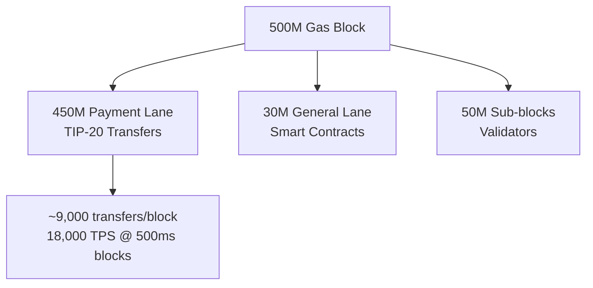

TIP-20 is Tempo's enshrined token standard — an ERC-20 superset with built-in features for high-throughput stablecoin payments.

<Note>
**ERC-20 Compatible**: TIP-20 tokens are fully compatible with existing ERC-20 infrastructure, tools, and integrations. The extensions are additive.
</Note>

## Why TIP-20?

Traditional ERC-20 tokens lack features critical for institutional payment infrastructure:

<CardGroup cols={2}>
  <Card title="No Payment Reconciliation" icon="receipt">
    Standard transfers have no native way to attach invoice numbers, references, or memo fields.
  </Card>
  <Card title="Unpredictable Throughput" icon="gauge">
    Token transfers compete for block space with all other transactions, causing congestion.
  </Card>
  <Card title="Per-Token Compliance" icon="shield-check">
    Each token implements its own transfer restrictions, causing inconsistency and integration overhead.
  </Card>
  <Card title="High Gas Costs" icon="gas-pump">
    Standard ERC-20 transfers cost 65k-100k+ gas due to inefficient storage patterns.
  </Card>
</CardGroup>

TIP-20 addresses these issues through protocol-level integration.

## Core Features

### 1. Payment Lanes

TIP-20 transfers access **dedicated payment lanes** with guaranteed capacity:

- **450M gas/block** reserved for payment transactions
- **General transactions** capped at 30M gas, ensuring payment throughput
- **Predictable inclusion**: Payment lane priority prevents noisy-neighbor problems



<Info>
At 50,000 gas per TIP-20 transfer and 450M gas payment capacity, Tempo can process **~9,000 transfers per block** or **~18,000 TPS** at 500ms block times.
</Info>

### 2. On-Transfer Memos

Attach **32-byte memo fields** directly to transfers for reconciliation:

<CodeGroup>
```typescript Direct Memo
import { ITIP20 } from '@tempo/contracts';

const receipt = await token.transferWithMemo(
  recipient,
  parseUnits('1000', 6), // 1000 tokens
  ethers.encodeBytes32String('INV-2024-001') // Invoice reference
);

// Memo is indexed and retrievable from logs
```

```solidity Smart Contract
function payInvoice(address token, address recipient, uint256 amount, bytes32 invoiceId) external {
    ITIP20(token).transferWithMemo(recipient, amount, invoiceId);
}
```
</CodeGroup>

**Event Emitted:**
```solidity
event TransferWithMemo(
    address indexed from,
    address indexed to,
    uint256 amount,
    bytes32 indexed memo
);
```

### 3. Commitment Patterns

For **large data or PII**, use hash commitments to keep sensitive data off-chain:

<AccordionGroup>
  <Accordion title="Hash Commitment">
    Store a hash of off-chain data on-chain for verification:
    
    ```typescript
    const offChainData = JSON.stringify({
      invoice_number: 'INV-2024-001',
      description: 'Monthly subscription',
      customer_details: { /* PII */ },
    });
    
    const hash = keccak256(toUtf8Bytes(offChainData));
    await token.transferWithMemo(recipient, amount, hash);
    
    // Store offChainData in your database, indexed by hash
    ```
    
    **Verification**: Recipients can verify received data matches the hash commitment.
  </Accordion>
  
  <Accordion title="Locator Pattern">
    Store a reference to external data (URL, database key, etc.):
    
    ```typescript
    const locator = ethers.encodeBytes32String('https://api.example.com/invoice/12345');
    await token.transferWithMemo(recipient, amount, locator);
    ```
    
    **Use case**: Large documents, multi-page invoices, detailed transaction metadata.
  </Accordion>
</AccordionGroup>

<Warning>
**Privacy Consideration**: Memos and hashes are public on-chain. Never put raw PII in the memo field — always use hash commitments.
</Warning>

### 4. TIP-403 Policy Registry

Shared **compliance policies** across multiple tokens:

```solidity
// Create a policy once
ITIP403Registry registry = ITIP403Registry(POLICY_REGISTRY_ADDRESS);
uint256 policyId = registry.createPolicy(transferHooksAddress);

// Apply to multiple tokens
token1.setPolicyId(policyId);
token2.setPolicyId(policyId);
token3.setPolicyId(policyId);

// Update policy once, enforced everywhere
registry.updatePolicy(policyId, newTransferHooksAddress);
```

**Benefits:**
- **Single update propagates**: Change compliance rules for all tokens at once
- **Consistent enforcement**: Same rules across token portfolio
- **Reduced integration overhead**: Deploy hooks contract once, apply to many tokens

<Card title="TIP-403 Specification" icon="book" href="/protocol/precompiles/tip403-registry">
  Complete documentation of the Policy Registry system
</Card>

## Token Lifecycle

### Deployment via TIP-20 Factory

TIP-20 tokens are deployed through the **TIP-20 Factory precompile** for gas efficiency:

```typescript
import { ITIP20Factory } from '@tempo/contracts';

const factory = ITIP20Factory.connect(TIP20_FACTORY_ADDRESS, signer);

const tx = await factory.createToken(
  'AlphaUSD',           // name
  'AUSD',               // symbol
  6,                    // decimals
  ownerAddress,         // owner
  parseUnits('1000000', 6), // initial supply
  0,                    // policy ID (0 = no policy)
  ethers.ZeroAddress    // quote token (for DEX)
);

const receipt = await tx.wait();
const tokenAddress = receipt.logs[0].address; // TIP-20 address
```

**Token Address Format**: `0x20c0xxxxxxxxxxxxxxxxxxxxxxxxxxxxxxxxxxxx`
- All TIP-20 tokens share the `0x20c0` prefix
- Remaining 18 bytes uniquely identify the token
- Enables efficient precompile routing

### Token Roles

TIP-20 implements OpenZeppelin-style role-based access control:

<CardGroup cols={2}>
  <Card title="Owner" icon="crown">
    Full control over token configuration, role assignments, and critical operations.
  </Card>
  <Card title="Minter" icon="plus">
    Can mint new tokens to any address (if not immutably capped).
  </Card>
  <Card title="Burner" icon="fire">
    Can burn tokens from any address (for redemptions, deflationary mechanics).
  </Card>
  <Card title="Pauser" icon="pause">
    Can pause/unpause transfers (emergency stop mechanism).
  </Card>
</CardGroup>

```solidity
// Grant roles
token.grantRole(MINTER_ROLE, minterAddress);
token.grantRole(BURNER_ROLE, burnerAddress);

// Revoke roles
token.revokeRole(MINTER_ROLE, minterAddress);
```

## Gas Costs

TIP-20 is optimized for low-cost transfers:

| Operation | Gas Cost | USD @ 0.1¢/50k gas |
|-----------|----------|-----------------|
| Transfer to existing address | ~50,000 | $0.001 (0.1¢) |
| Transfer to new address | ~300,000 | $0.006 (0.6¢) |
| Transfer with memo | ~52,000 | $0.001 (0.1¢) |
| Approve | ~45,000 | $0.0009 (0.09¢) |
| Mint | ~55,000 | $0.0011 (0.11¢) |
| Burn | ~55,000 | $0.0011 (0.11¢) |

<Info>
**New address cost**: First-time transfers to an address cost ~250k gas more due to TIP-1000 state creation pricing (anti-spam measure).
</Info>

### Comparison with ERC-20

```mermaid
bar
    title "Gas Cost Comparison (existing recipient)"
    x-axis [ERC-20, TIP-20]
    y-axis "Gas" 0 --> 100000
    bar [65000, 50000]
```

**Why TIP-20 is cheaper:**
- Enshrined precompile (no contract call overhead)
- Optimized storage layout
- Efficient balance tracking
- Payment lane reduces contention

## Advanced Features

### Permit (EIP-2612)

Gasless approvals via off-chain signatures:

```typescript
import { signTypedData } from 'viem';

const domain = {
  name: await token.name(),
  version: '1',
  chainId: TEMPO_CHAIN_ID,
  verifyingContract: tokenAddress,
};

const types = {
  Permit: [
    { name: 'owner', type: 'address' },
    { name: 'spender', type: 'address' },
    { name: 'value', type: 'uint256' },
    { name: 'nonce', type: 'uint256' },
    { name: 'deadline', type: 'uint256' },
  ],
};

const value = {
  owner: ownerAddress,
  spender: spenderAddress,
  value: parseUnits('1000', 6),
  nonce: await token.nonces(ownerAddress),
  deadline: Math.floor(Date.now() / 1000) + 3600, // 1 hour
};

const signature = await signTypedData({ domain, types, value });
const { v, r, s } = signature;

// Spender can now execute permit + transfer atomically
await token.permit(owner, spender, value.value, value.deadline, v, r, s);
await token.transferFrom(owner, recipient, value.value);
```

### Rewards Distribution

Protocol-level reward accrual for validators:

```solidity
// Validators earn rewards from TIP-20 activity
function setRewardRecipient(address recipient) external {
    // Direct rewards to another address (e.g., staking pool)
}

function claimRewards() external {
    // Claim accumulated rewards from TIP-20 transfers
}
```

<Info>
Rewards are distributed to validators based on their participation in consensus and block production. Token holders do not need to do anything.
</Info>

### Quote Token (DEX Integration)

Tokens can specify a **quote token** for automated DEX pairing:

```typescript
// Set quote token to create DEX pair
await token.setQuoteToken(usdcAddress);

// Initiates quote token update (48-hour delay)
await token.setNextQuoteToken(usdtAddress);

// Complete update after delay
await token.completeQuoteTokenUpdate();
```

**Use case**: Automatic liquidity routing through the Stablecoin DEX precompile.

## Compliance & Transfer Policies

### Transfer Hooks (TIP-403)

Transfer policies are enforced via **hooks contracts** registered in TIP-403:

```solidity
interface ITransferPolicy {
    function beforeTransfer(
        address token,
        address from,
        address to,
        uint256 amount
    ) external returns (bool);
    
    function afterTransfer(
        address token,
        address from,
        address to,
        uint256 amount
    ) external;
}
```

**Example Policies:**
- **KYC/AML**: Verify sender/recipient are on whitelist
- **Transfer limits**: Enforce daily/monthly caps
- **Jurisdiction restrictions**: Block transfers to sanctioned addresses
- **Business hours**: Only allow transfers during specific times

### Pause Mechanism

Emergency transfer halt:

```typescript
// Pause all transfers
await token.pause();

// Approvals still work (non-value-moving)
await token.approve(spender, amount); // ✅ Allowed

// Transfers revert
await token.transfer(recipient, amount); // ❌ Reverts

// Resume transfers
await token.unpause();
```

<Warning>
**Pause privileges**: Only addresses with the PAUSER role can pause/unpause. Use multi-sig or governance for production.
</Warning>

## Integration Guide

### Querying Token Metadata

```typescript
import { ITIP20 } from '@tempo/contracts';

const token = ITIP20.connect(tokenAddress, provider);

const name = await token.name();
const symbol = await token.symbol();
const decimals = await token.decimals();
const totalSupply = await token.totalSupply();
const balance = await token.balanceOf(userAddress);
```

### Watching Transfer Events

```typescript
// Standard ERC-20 Transfer event
token.on('Transfer', (from, to, amount, event) => {
  console.log(`${formatUnits(amount, 6)} transferred from ${from} to ${to}`);
});

// TIP-20 TransferWithMemo event
token.on('TransferWithMemo', (from, to, amount, memo, event) => {
  const memoString = ethers.toUtf8String(memo).replace(/\0/g, '');
  console.log(`Transfer memo: ${memoString}`);
});
```

### Allowance Pattern

```typescript
// Standard ERC-20 approve/transferFrom flow
await token.connect(owner).approve(spender, parseUnits('1000', 6));

// Spender executes transfer
await token.connect(spender).transferFrom(
  owner,
  recipient,
  parseUnits('500', 6)
);

// Check remaining allowance
const remaining = await token.allowance(owner, spender);
```

## Compatibility Matrix

| ERC-20 Feature | TIP-20 Support | Notes |
|----------------|----------------|-------|
| `transfer` | ✅ Full | Standard transfer |
| `transferFrom` | ✅ Full | Allowance-based transfer |
| `approve` | ✅ Full | Set spending allowance |
| `balanceOf` | ✅ Full | Query balance |
| `totalSupply` | ✅ Full | Query total supply |
| `decimals` | ✅ Full | Token decimals |
| `name` | ✅ Full | Token name |
| `symbol` | ✅ Full | Token symbol |
| `permit` (EIP-2612) | ✅ Full | Gasless approvals |

**Additional TIP-20 Features:**
- `transferWithMemo` - Transfer with 32-byte memo
- `setPolicyId` - Apply TIP-403 policy
- `setQuoteToken` - Configure DEX pairing
- Role-based minting/burning/pausing

## Best Practices

<AccordionGroup>
  <Accordion title="Always Use Memos for Business Payments">
    Attach invoice numbers, order IDs, or reference codes to enable automatic reconciliation. Use hash commitments for sensitive data.
  </Accordion>
  
  <Accordion title="Deploy Through Factory">
    Use the TIP-20 Factory precompile for gas-efficient deployment and guaranteed address format.
  </Accordion>
  
  <Accordion title="Implement Transfer Policies Early">
    Define your compliance requirements before mainnet. TIP-403 makes updates easy, but design thoughtfully.
  </Accordion>
  
  <Accordion title="Use Multi-Sig for Privileged Roles">
    OWNER, MINTER, and PAUSER roles should be controlled by multi-sig or governance contracts in production.
  </Accordion>
  
  <Accordion title="Test Policy Updates">
    TIP-403 policies affect all tokens using that policy. Test updates thoroughly on testnet before applying to mainnet.
  </Accordion>
</AccordionGroup>

## SDK Examples

<CardGroup cols={2}>
  <Card title="TypeScript SDK" icon="js" href="/protocol/tip20/overview">
    Complete TIP-20 integration examples with memos, policies, and advanced features.
  </Card>
  <Card title="Rust SDK" icon="rust" href="/protocol/tip20/overview">
    Type-safe TIP-20 contract bindings for Rust applications.
  </Card>
</CardGroup>

## Further Reading

<CardGroup cols={2}>
  <Card title="TIP-20 Specification" icon="book" href="/protocol/tip20/overview">
    Complete technical specification of the TIP-20 standard
  </Card>
  <Card title="TIP-403 Policy Registry" icon="shield-check" href="/protocol/precompiles/tip403-registry">
    Shared compliance policies across multiple tokens
  </Card>
  <Card title="Stablecoin DEX" icon="arrows-rotate" href="/protocol/fees/overview">
    On-chain order book for stablecoin swaps
  </Card>
  <Card title="Fee AMM" icon="dollar-sign" href="/protocol/fees/fee-amm">
    Multi-currency fee payment mechanism
  </Card>
</CardGroup>
