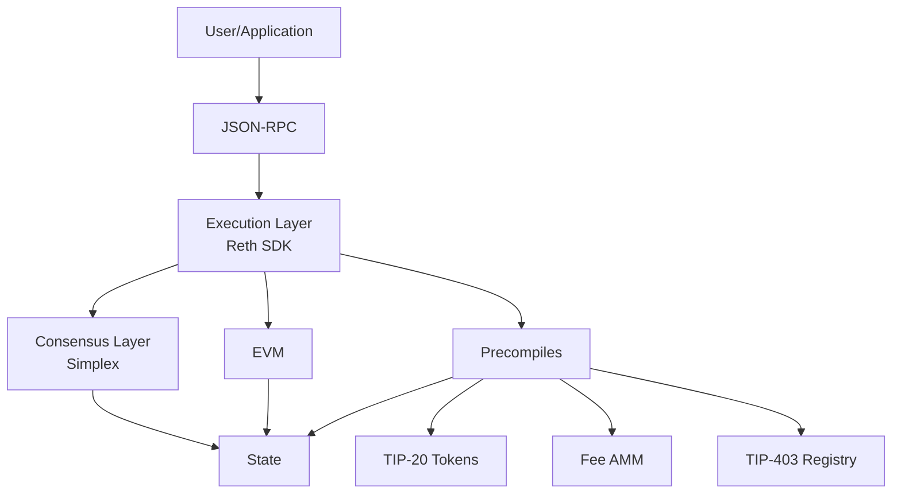

Tempo is a blockchain designed specifically for stablecoin payments. Built for financial institutions, payment service providers, and fintech platforms, Tempo delivers high throughput, predictable low costs, and features that modern payment infrastructure demands.

## What makes Tempo different

Tempo introduces payment-specific innovations while maintaining full EVM compatibility, giving you the best of both worlds: familiar Ethereum tooling with purpose-built payment features.

### TIP-20 token standard

TIP-20 extends ERC-20 with features designed for payment workflows:

<CardGroup cols={2}>
  <Card title="Dedicated payment lanes" icon="road">
    Predictable throughput via reserved lanes for TIP-20 transfers, eliminating noisy-neighbor contention from general contract execution
  </Card>
  <Card title="Native reconciliation" icon="receipt">
    On-transfer memos and commitment patterns (hash/locator) for linking to off-chain PII and large data
  </Card>
  <Card title="Built-in compliance" icon="shield-check">
    [TIP-403 Policy Registry](/protocol/precompiles/tip403-registry) allows single policies shared across multiple tokens, updated once and enforced everywhere
  </Card>
  <Card title="Sub-millidollar fees" icon="dollar-sign">
    TIP-20 transfers target costs below $0.001 per transaction
  </Card>
</CardGroup>

Learn more about [TIP-20](/protocol/tip20/overview).

### Low, predictable fees in stablecoins

<Note>
Users pay gas directly in USD-stablecoins at launch. No need to acquire and manage a volatile native token.
</Note>

The [Fee AMM](/protocol/fees/fee-amm) automatically converts your stablecoin payment to the validator's preferred stablecoin, providing seamless multi-currency support.

**Target costs:**
- TIP-20 transfers: < $0.001
- Account creation: ~$0.005
- Transfer to new address: ~$0.006

### Tempo Transactions (native smart accounts)

Tempo Transactions provide account abstraction features at the protocol level:

<Steps>
  <Step title="Batched payments">
    Execute atomic multi-operation payouts for payroll, settlements, and refunds in a single transaction
  </Step>
  <Step title="Fee sponsorship">
    Apps can pay users' gas to streamline onboarding and improve user experience
  </Step>
  <Step title="Scheduled payments">
    Protocol-level time windows for recurring and timed disbursements
  </Step>
  <Step title="Modern authentication">
    Passkeys via WebAuthn/P256 enable biometric sign-in, secure enclave, and cross-device sync
  </Step>
</Steps>

Learn more about [Tempo Transactions](/concepts/tempo-transactions).

### Performance and finality

<CardGroup cols={2}>
  <Card title="Built on Reth SDK" icon="gauge-high">
    Leverages the [Reth SDK](https://github.com/paradigmxyz/reth), the most performant and flexible EVM execution client
  </Card>
  <Card title="Simplex Consensus" icon="clock">
    Fast, sub-second finality in normal conditions with graceful degradation under adverse networks (via [Commonware](https://commonware.xyz/))
  </Card>
</CardGroup>

### Coming soon

<Warning>
These features are in development and not yet available on testnet.
</Warning>

- **On-chain FX**: Non-USD stablecoin support for direct on-chain liquidity; pay fees in multiple currencies
- **Native private token standard**: Opt-in privacy for balances and transfers coexisting with issuer compliance and auditability

## What makes Tempo familiar

Tempo is fully compatible with the Ethereum Virtual Machine (EVM), targeting the Osaka hardfork:

<CardGroup cols={3}>
  <Card title="Same languages" icon="code">
    Write contracts in Solidity, Vyper, or any EVM language
  </Card>
  <Card title="Same tools" icon="wrench">
    Use Foundry, Hardhat, Remix, and all your favorite frameworks
  </Card>
  <Card title="Same APIs" icon="plug">
    All Ethereum JSON-RPC methods work out of the box
  </Card>
</CardGroup>

While the execution environment mirrors Ethereum's, Tempo introduces some optimizations for payments. See [EVM compatibility](/concepts/evm-compatibility) for details.

## Architecture overview

### Key components

- **Execution Layer**: Built on Reth SDK for high-performance transaction processing
- **Consensus Layer**: Simplex consensus via Commonware for fast finality
- **Precompiles**: Enshrined contracts for TIP-20 tokens, fee management, and compliance
- **State**: Efficient state management targeting 20,000+ TPS

## Use cases

Tempo is designed for applications that need to move money at scale:

<CardGroup cols={2}>
  <Card title="Payment processors" icon="money-bill-transfer">
    High-volume payment processing with predictable costs and built-in reconciliation
  </Card>
  <Card title="Fintech platforms" icon="building-columns">
    Consumer payment apps with gasless transactions and stablecoin-native fees
  </Card>
  <Card title="Payroll systems" icon="users">
    Batch payments for salaries, invoices, and vendor settlements
  </Card>
  <Card title="Remittances" icon="globe">
    Cross-border transfers with low fees and fast finality
  </Card>
</CardGroup>

## Getting started

Ready to build on Tempo? Here's what to do next:

<CardGroup cols={2}>
  <Card title="Quickstart" icon="rocket" href="/quickstart">
    Connect to testnet and make your first transaction in 5 minutes
  </Card>
  <Card title="SDK Documentation" icon="book" href="/sdk/overview">
    Explore TypeScript, Rust, Go, and Foundry SDKs
  </Card>
  <Card title="TIP-20 Guide" icon="coins" href="/protocol/tip20/overview">
    Learn about the TIP-20 token standard
  </Card>
  <Card title="Run a Node" icon="server" href="/node/installation">
    Set up your own Tempo node
  </Card>
</CardGroup>

## Network details

<Note>
Tempo is currently in testnet. Mainnet launch date TBD.
</Note>

| Property | Value |
| --- | --- |
| **Network Name** | Tempo Testnet (Moderato) |
| **Chain ID** | `42431` |
| **Currency** | `USD` |
| **RPC URL** | `https://rpc.moderato.tempo.xyz` |
| **WebSocket** | `wss://rpc.moderato.tempo.xyz` |
| **Block Explorer** | `https://explore.tempo.xyz` |

## Community and support

<CardGroup cols={3}>
  <Card title="Documentation" icon="book" href="https://docs.tempo.xyz">
    Comprehensive guides and API references
  </Card>
  <Card title="GitHub" icon="github" href="https://github.com/tempoxyz/tempo">
    Source code and issue tracking
  </Card>
  <Card title="Website" icon="globe" href="https://tempo.xyz">
    Learn more about Tempo
  </Card>
</CardGroup>
